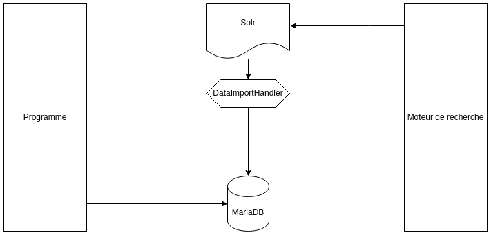

# Formation Solr TP

## But



Nous allons ajouter des données dans une base MariaDB via une application (write).
Au travers d'un DataImportHandler, Solr va indexer, selon une requête définit, 
ces données. Et nous pourrons les restituer au travers du moteur de recherche.  

## Pour commencer

### Cloner le projet

```git
git clone https://github.com/FC-Consulting/formation-solr-tp.git
cd formation-solr-tp
```

### MariaDB

```shell
...
```

### Solr 

Attention, l'ajout de paquets dans Solr nécessite une install en Cluster.

```shell
bin/solr start -c -Denable.packages=true
bin/solr package add-repo data-import-handler "https://raw.githubusercontent.com/rohitbemax/dataimporthandler/master/repo/"
bin/solr package list-available
bin/solr package install data-import-handler

curl "http://localhost:8983/solr/admin/collections?action=CREATE&name=products&numShards=1"

```

## Etape 2 :: Vérification 

```shell
./gradlew run
```

```shell
> Task :app:run
Hello World!

BUILD SUCCESSFUL in 992ms
2 actionable tasks: 2 executed
```

## Etape 3 :: Ajout des dépendances

```groovy
dependencies {
    ...
    implementation 'org.apache.camel:camel-solr:2.9'
}
```

## Etape 4 :: 
